<!-- PROFILE:START -->
<picture>
  <source media="(prefers-color-scheme: dark)" srcset="assets/panel-dark.svg">
  
</picture>

I explore porous materials through classical density functional theory (cDFT), molecular simulation, machine learning, and AI-assisted research workflows.

[Porous materials design](https://github.com/Yong-Q/Reverse-design-of-porous-materials) · [Sep-Pilot](https://github.com/Yong-Q/Sep-Pilot) · [String_Vext](https://github.com/Yong-Q/String_Vext)

[Related paper · Chemical Science (2025)](https://doi.org/10.1039/D5SC04332H) · [Research dataset · Zenodo](https://doi.org/10.5281/zenodo.14910258)

### Recently updated

| Project | Focus | Latest code update |
| :--- | :--- | :--- |
| [String_Vext](https://github.com/Yong-Q/String_Vext) | Diffusion pathway optimization and orientation-resolved energy landscapes. | 2026-10-01 |
| [Sep-Pilot](https://github.com/Yong-Q/Sep-Pilot) | An AI research copilot for planning and tracking molecular simulation workflows. | 2026-09-20 |
| [DFT](https://github.com/Yong-Q/DFT) | Code repository | 2026-05-16 |
| [Reverse-design-of-porous-materials](https://github.com/Yong-Q/Reverse-design-of-porous-materials) | Combine machine learning algorithm to reverse design materials, from function to material exploration | 2025-08-30 |

Public repository metadata refreshes hourly. Featured projects are curated; recent projects update automatically.
<!-- PROFILE:END -->
